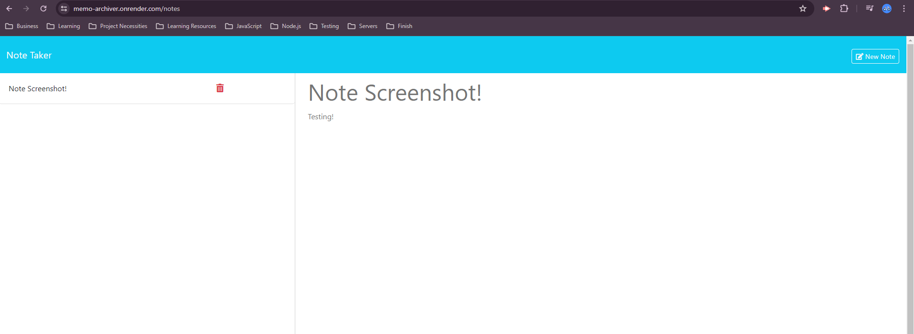

# Memo-Archiver

- 
This application is for note taking, and is deployed using the free version of render.

## Description

- My motivation for building this application was to create a note taking application called memo archiver that allows the client to take notes on their device.
- This project was built to assist the client with taking notes so they dont need a pen, and paper.
- This solves the problem of not being able to take notes conveniently.
- In this project, I learned that Express is a framework that enables me to concentrate on backend development seamlessly, without affecting the live deployment of the website.

## Table of Contents (Optional)

Here is a table of contents to make it easy for users to locate which section they need.

- [Installation](#installation)
- [Usage](#usage)
- [Credits](#credits)
- [License](#license)

## Installation

You'll need to install GitBash, VS Code, Node.js, NPM, Express, and Render. From here you will need knowledge on how to clone a repo from GitHub over to your device to store it locally. Once its stored locally in your device you can open VSCode. Lastly once VSCode is running open the CLI (Command-Line-Interface), type npm install for the node_modules package, then type npm run start. Once you've done this the website will be deployed locally for testing, debugging, and developing.

## Usage

Take notes conveniently on your device at anytime with the Memo Archiver. Store your notes here safely, and check back when you want to see the saved notes.

- <strong>Memo Archiver Screenshots:</strong>

## Support

N/A

## Credits

People who worked on this project were bwater47. You can contact the contributors through the github profiles links listed here.
- Link: <a href="https://github.com/bwater47" alt="GitHub Link">GitHub Profile</a>

## License

- 
- This is an [https://choosealicense.com/licenses/mit/](https://choosealicense.com/licenses/mit/) license.

## Features

Note Organizer: Allows the client to take notes, delete notes, and see notes that they have taken in a column.

## Contributing

Contributing is allowed if you're in the U of U Coding Bootcamp. Contact us on the slack channel for information. 
- [Contributor Covenant](https://www.contributor-covenant.org/)

## Authors and Acknowledgment

Cloud application hosting for developers. Render. (05/15/24). https://dashboard.render.com/ 

Routing. Express routing. (05/15/24). https://expressjs.com/en/guide/routing.html#express-router 

CLI commands. npm Docs. (05/15/24). https://docs.npmjs.com/cli/v10/commands

Node.js V22.0.0 documentation. Command-line API | Node.js v22.0.0 Documentation. (05/15/24). https://nodejs.org/api/cli.html

MozDevNet. (05/15/24). Resources for developers, by developers. MDN Web Docs. https://developer.mozilla.org/en-US/ 

Bootcamp Spot. (05/15/24). https://bootcampspot.com/

W3Schools Online Web Tutorials. (05/15/24). https://www.w3schools.com/

Chatgpt. ChatGPT. (05/15/24). https://openai.com/chatgpt

• Please note: While ChatGPT was utilized to generate dialog content for the README file, it was not involved in the generation of any code, HTML edits, CSS edits, or other assets within the repository apart from this README specifically.

• All other sources, links, and information utilized within the project were obtained from the provided sources mentioned in this paragraph. This includes class materials, modules, TA guidance, instructor-provided resources, as well as communication through platforms such as Slack or Discord. Additionally, numerous links and resources were provided within the assignment instructions and demonstrated during class sessions.

## Roadmap

Tests: N/A

## Project status

In-Progress